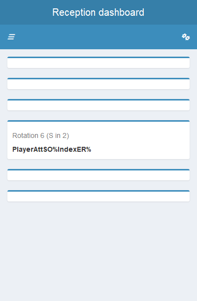

<!-- README.md is generated from README.Rmd. Please edit that file -->

# datavolleyXtra

<!-- badges: start -->
<!-- badges: end -->

datavolleyXtra is a supplementary to
<https://github.com/openvolley/datavolley>.

- Parsing additions

- Tables

- Plots

## Installation

You can install the development version of datavolleyXtra from
[GitHub](https://github.com/) with:

``` r
# install.packages("devtools")
devtools::install_github("tyler-widdison/datavolleyXtra")
```

## Reading datavolley files

``` r
library(datavolleyXtra)
#> Loading required package: magrittr
df <- dv_readXtra("dvws")
#> Joining with `by = join_by(x)`
#> Joining with `by = join_by(team, player_name)`
#> Joining with `by = join_by(x)`
#> Joining with `by = join_by(team, player_name)`
#> Joining with `by = join_by(x)`
#> Joining with `by = join_by(team, player_name)`
#> Joining with `by = join_by(x)`
#> Joining with `by = join_by(team, player_name)`
#> Joining with `by = join_by(x)`
#> Joining with `by = join_by(team, player_name)`
#> Joining with `by = join_by(x)`
#> Joining with `by = join_by(team, player_name)`
#> Joining with `by = join_by(x)`
#> Joining with `by = join_by(team, player_name)`
#> Joining with `by = join_by(x)`
#> Joining with `by = join_by(team, player_name)`
```

------------------------------------------------------------------------

#### Additions

- set_player

- Player

- opponent

- reception_quality

- dig_quality

- setter_position

- filename

- date

- dashboards

- plots

- \+ more!

------------------------------------------------------------------------

## Dashboards

### Rotation rec table

``` r
rec_app(df)
#> Loading required package: shiny
#> Warning: package 'shiny' was built under R version 4.3.1
#> 
#> Listening on http://127.0.0.1:4828
```


